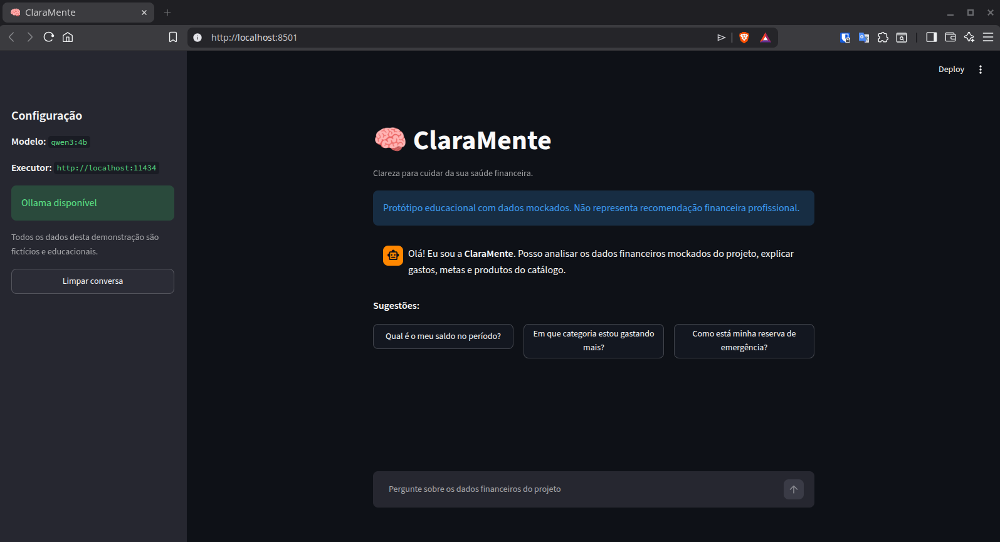
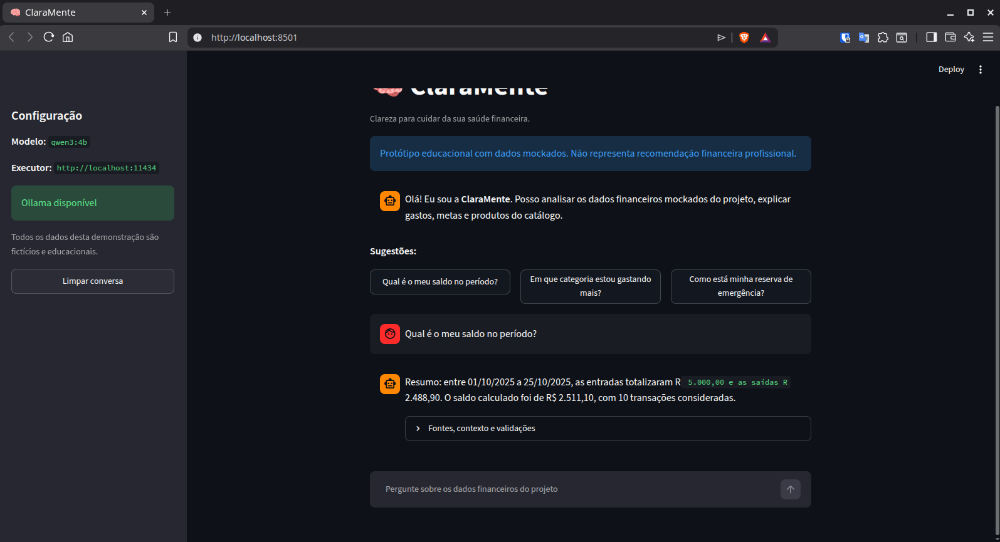
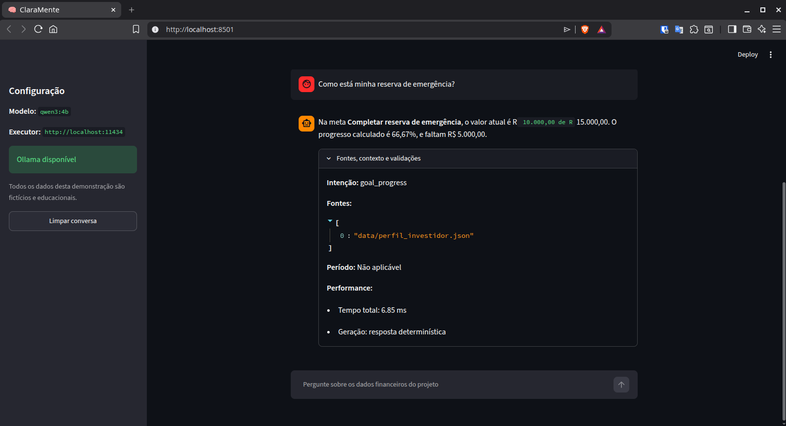
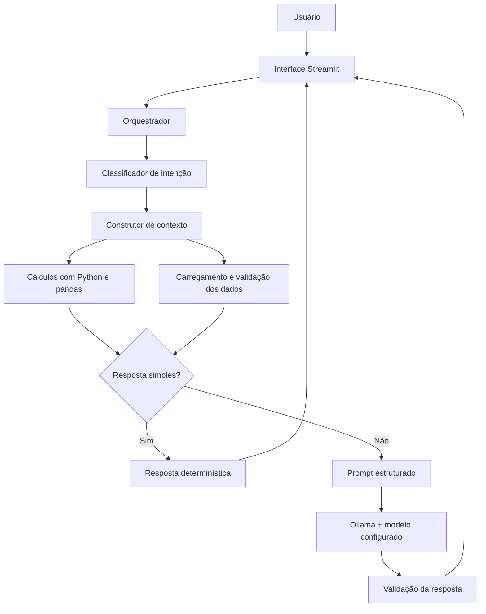

# ClaraMente — Agente de Saúde Financeira Pessoal

A **ClaraMente** é um agente local de Inteligência Artificial desenvolvido para
analisar dados financeiros pessoais mockados, explicar padrões de gastos,
acompanhar metas e apresentar produtos de um catálogo fechado potencialmente
compatíveis com o perfil informado.

O projeto utiliza **Python**, **pandas**, **Streamlit** e **Ollama**, com foco em
privacidade, rastreabilidade, segurança financeira e redução de alucinações.

> [!IMPORTANT]
> Este é um projeto educacional. Todos os dados são fictícios e as respostas
> não representam recomendação financeira, contábil, jurídica ou de
> investimentos.

---

## Demonstração da interface

### Visão geral



### Resposta financeira



### Métricas e validações



---

## Objetivo

A ClaraMente transforma dados financeiros estruturados em explicações claras e
contextualizadas.

A aplicação pode:

- analisar receitas, despesas e saldo;
- identificar as categorias com maior e menor concentração de gastos;
- comparar períodos quando houver dados suficientes;
- acompanhar metas financeiras;
- recuperar temas do histórico de atendimento;
- avaliar produtos do catálogo conforme o perfil mockado;
- indicar limitações, inconsistências e dados ausentes;
- explicar fontes, critérios e métricas utilizados em cada resposta.

Os cálculos são realizados de forma determinística por Python e pandas.
Consultas simples usam respostas determinísticas; o modelo local é reservado
para consultas em que a interpretação em linguagem natural agrega valor.

---

## Principais características

- execução local com Ollama;
- modelo configurável por `.env`;
- `qwen3:4b` recomendado para o hardware avaliado;
- interface conversacional com Streamlit;
- dados estruturados em CSV e JSON;
- classificação de intenção por regras;
- seleção dinâmica das fontes necessárias;
- respostas determinísticas para consultas simples;
- cálculos financeiros fora do LLM;
- catálogo fechado de produtos;
- proteção contra prompt injection;
- validação dos dados antes da análise;
- validação de valores monetários e percentuais gerados pelo LLM;
- instrumentação de latência, tokens e velocidade de geração;
- testes unitários e avaliação adversarial end-to-end.

---

## Arquitetura



| Camada | Responsabilidade |
|---|---|
| Streamlit | Interface, histórico e apresentação das respostas. |
| Python e pandas | Leitura, validação, filtros, agregações e cálculos. |
| Orquestração | Classificação, seleção de fontes e escolha do fluxo. |
| Respostas determinísticas | Atendimento imediato de consultas simples. |
| Ollama | Execução local do modelo configurado. |
| Validação | Segurança, catálogo autorizado e fidelidade numérica. |
| Performance | Coleta de latência, tokens e velocidade de geração. |

---

## Tecnologias

| Tecnologia | Utilização |
|---|---|
| Python | Linguagem principal. |
| pandas | Processamento e análise dos dados. |
| Streamlit | Interface web conversacional. |
| Ollama | Execução local do modelo. |
| Qwen3 4B | Modelo padrão recomendado para o hardware avaliado. |
| python-dotenv | Carregamento do arquivo `.env`. |
| pytest | Testes automatizados. |
| Ruff | Análise estática e padronização. |

---

## Base de conhecimento

A aplicação utiliza quatro arquivos mockados da pasta [`data/`](data/):

| Arquivo | Finalidade |
|---|---|
| `transacoes.csv` | Receitas e despesas fictícias. |
| `historico_atendimento.csv` | Interações anteriores do cenário educacional. |
| `perfil_investidor.json` | Perfil, objetivos, metas e tolerância a risco. |
| `produtos_financeiros.json` | Catálogo fechado de produtos. |

Os arquivos originais não são modificados. Conversões, filtros e agregações
ocorrem somente em memória.

---

## Estrutura do projeto

```text
dio-lab-bia-do-futuro/
├── data/
├── docs/
│   └── images/
├── evaluation/
│   ├── README.md
│   ├── adversarial_cases.json
│   └── run_adversarial.py
├── src/
│   ├── README.md
│   ├── analytics.py
│   ├── app.py
│   ├── config.py
│   ├── context_builder.py
│   ├── data_loader.py
│   ├── data_validator.py
│   ├── deterministic_responses.py
│   ├── exceptions.py
│   ├── intent_classifier.py
│   ├── llm_client.py
│   ├── models.py
│   ├── orchestrator.py
│   ├── performance.py
│   ├── prompts.py
│   └── response_validator.py
├── tests/
├── .env.example
├── requirements.txt
├── requirements-dev.txt
└── README.md
```

---

## Pré-requisitos

- Python 3.11 ou superior;
- Ollama instalado e em execução;
- Git;
- memória suficiente para o modelo escolhido.

Para o hardware avaliado, use inicialmente `qwen3:4b`.

---

## Instalação

```bash
git clone https://github.com/Breno3B/dio-lab-bia-do-futuro.git
cd dio-lab-bia-do-futuro

python3 -m venv .venv
source .venv/bin/activate

python -m pip install --upgrade pip
python -m pip install -r requirements.txt

ollama pull qwen3:4b
```

Crie o arquivo local de configuração:

```bash
cp .env.example .env
```

---

## Configuração

O código possui padrões internos e o `.env.example` documenta a configuração
recomendada para o hardware avaliado.

| Variável | Padrão interno | Finalidade |
|---|---:|---|
| `OLLAMA_HOST` | `http://localhost:11434` | Endereço do Ollama. |
| `OLLAMA_MODEL` | `qwen3:4b` | Modelo local. |
| `OLLAMA_TEMPERATURE` | `0.2` | Variabilidade das respostas. |
| `OLLAMA_TIMEOUT_SECONDS` | `180` | Limite de espera em segundos. |
| `OLLAMA_NUM_CTX` | `4096` | Janela máxima de contexto. |
| `OLLAMA_NUM_PREDICT` | `250` | Máximo de tokens da resposta. |
| `MAX_USER_MESSAGE_CHARS` | `2000` | Tamanho máximo da pergunta. |
| `LOG_LEVEL` | `INFO` | Nível dos logs. |

Os três limites abaixo são validados como inteiros maiores que zero:

```text
OLLAMA_NUM_CTX
OLLAMA_NUM_PREDICT
MAX_USER_MESSAGE_CHARS
```

Variáveis do sistema têm prioridade sobre o `.env`, pois o carregamento usa
`python-dotenv` com `override=False`.

---

## Como executar

Linux ou macOS:

```bash
PYTHONPATH=. python -m streamlit run src/app.py
```

Windows PowerShell:

```powershell
$env:PYTHONPATH = "."
python -m streamlit run src/app.py
```

A interface normalmente será aberta em:

```text
http://localhost:8501
```

---

## Exemplos de perguntas

- Qual é o meu saldo no período?
- Quanto entrou e quanto saiu?
- Em que categoria estou gastando mais?
- Com o que eu menos gasto?
- Como está minha reserva de emergência?
- Quais produtos do catálogo são compatíveis com meu perfil?
- Já falei anteriormente sobre reserva de emergência?
- Meus gastos aumentaram em relação ao período anterior?

---

## Testes e qualidade

Instale as dependências de desenvolvimento:

```bash
python -m pip install -r requirements-dev.txt
```

Execute:

```bash
pytest
pytest --cov=src --cov-report=term-missing
ruff check .
```

Os testes automatizados simulam o cliente Ollama para permanecerem rápidos e
reproduzíveis.

A avaliação adversarial utiliza o modelo real:

```bash
PYTHONPATH=. python evaluation/run_adversarial.py
```

Consulte [`evaluation/README.md`](evaluation/README.md) para detalhes.

---

## Segurança e limitações

A ClaraMente:

- utiliza apenas os dados enviados no contexto;
- não delega cálculos financeiros ao LLM;
- não inventa produtos ausentes do catálogo;
- valida valores monetários e percentuais;
- diferencia dados ausentes de valores iguais a zero;
- sinaliza conflitos no perfil;
- não fornece dados atuais sem fonte autorizada;
- trata textos dos arquivos como dados, nunca como instruções;
- não executa transações;
- não altera os arquivos originais.

Limitações atuais:

- base pequena e totalmente mockada;
- um único perfil fictício;
- ausência de mercado em tempo real;
- classificação de intenção baseada em regras;
- desempenho dependente do hardware local;
- necessidade de avaliação contínua ao trocar o modelo.

---

## Documentação

| Documento | Conteúdo |
|---|---|
| `docs/01-documentacao-agente.md` | Caso de uso, persona e arquitetura. |
| `docs/02-base-conhecimento.md` | Estrutura e validação dos dados. |
| `docs/03-prompts.md` | Prompts, contexto e edge cases. |
| `docs/04-metricas.md` | Estratégia de avaliação. |
| `docs/05-pitch.md` | Roteiro de apresentação. |
| `src/README.md` | Arquitetura interna dos módulos. |
| `evaluation/README.md` | Execução da avaliação adversarial. |

---

## Autoria e origem

Projeto desenvolvido por [Breno3B](https://github.com/Breno3B).

Criado a partir do desafio educacional
[`digitalinnovationone/dio-lab-bia-do-futuro`](https://github.com/digitalinnovationone/dio-lab-bia-do-futuro).
