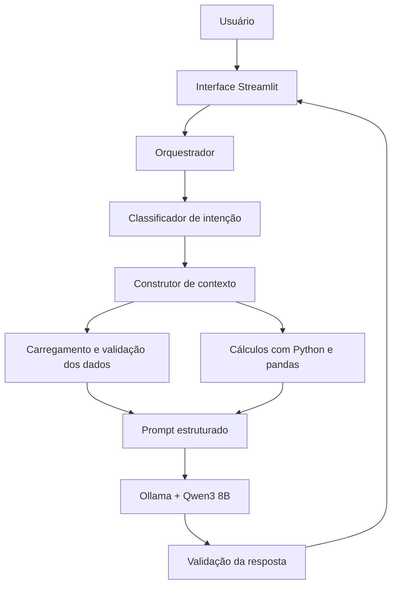

# ClaraMente — Agente de Saúde Financeira Pessoal

A **ClaraMente** é um agente local de Inteligência Artificial desenvolvido para analisar dados financeiros pessoais mockados, explicar padrões de gastos, acompanhar metas e apresentar produtos do catálogo potencialmente compatíveis com o perfil informado.

O projeto utiliza **Python**, **pandas**, **Streamlit**, **Ollama** e **Qwen3 8B**, com foco em privacidade, rastreabilidade, segurança financeira e redução de alucinações.

> [!IMPORTANT]
> Este é um projeto educacional. Todos os dados são fictícios e as respostas não representam recomendação financeira, contábil, jurídica ou de investimentos.

---

## Objetivo

A ClaraMente transforma dados financeiros estruturados em explicações claras e contextualizadas.

A aplicação pode:

- analisar receitas, despesas e saldo;
- identificar categorias com maior concentração de gastos;
- comparar períodos;
- acompanhar metas financeiras;
- recuperar temas do histórico de atendimento;
- avaliar a compatibilidade entre o perfil mockado e os produtos disponíveis;
- indicar limitações, inconsistências e dados ausentes;
- explicar os critérios utilizados em cada resposta.

Os cálculos são realizados de forma determinística por Python e pandas. O modelo de linguagem recebe os resultados já calculados e é responsável por interpretá-los e apresentá-los em linguagem natural.

---

## Principais Características

- execução local do LLM com Ollama;
- modelo principal Qwen3 8B;
- interface conversacional com Streamlit;
- dados estruturados em CSV e JSON;
- classificação inicial de intenção por regras;
- seleção dinâmica das fontes necessárias;
- cálculos financeiros fora do LLM;
- catálogo fechado de produtos financeiros;
- proteção contra prompt injection;
- validação dos dados antes da análise;
- validação básica das respostas;
- configurações locais por arquivo `.env`;
- testes automatizados com pytest.

---

## Arquitetura



### Separação de responsabilidades

| Camada | Responsabilidade |
|---|---|
| Streamlit | Interface, histórico da conversa e apresentação das respostas. |
| Python e pandas | Leitura, validação, filtros, agregações e cálculos. |
| Orquestração | Classificação da intenção, escolha das fontes e montagem do contexto. |
| Ollama | Execução local do modelo de linguagem. |
| Qwen3 8B | Interpretação da solicitação e geração da resposta textual. |
| Validação | Verificações de segurança, coerência e uso do catálogo autorizado. |

---

## Tecnologias

| Tecnologia | Utilização |
|---|---|
| [Python](https://www.python.org/) | Linguagem principal do projeto. |
| [pandas](https://pandas.pydata.org/) | Processamento e análise dos dados estruturados. |
| [Streamlit](https://streamlit.io/) | Interface web conversacional. |
| [Ollama](https://ollama.com/) | Execução local do modelo de linguagem. |
| [Qwen3 8B](https://ollama.com/library/qwen3:8b) | Modelo responsável pela geração das respostas. |
| [python-dotenv](https://pypi.org/project/python-dotenv/) | Carregamento das configurações locais do arquivo `.env`. |
| [pytest](https://docs.pytest.org/) | Testes automatizados. |
| [Ruff](https://docs.astral.sh/ruff/) | Verificação de qualidade e padronização do código. |

---

## Base de Conhecimento

A aplicação utiliza quatro arquivos mockados da pasta [`data/`](data/):

| Arquivo | Finalidade |
|---|---|
| [`transacoes.csv`](data/transacoes.csv) | Histórico fictício de receitas e despesas. |
| [`historico_atendimento.csv`](data/historico_atendimento.csv) | Interações anteriores do cenário educacional. |
| [`perfil_investidor.json`](data/perfil_investidor.json) | Perfil, objetivos, metas e tolerância a risco. |
| [`produtos_financeiros.json`](data/produtos_financeiros.json) | Catálogo fechado de produtos disponíveis. |

Os arquivos originais não são modificados. Conversões, filtros e agregações são realizados somente em memória.

---

## Estrutura do Projeto

```text
dio-lab-bia-do-futuro/
├── data/
│   ├── historico_atendimento.csv
│   ├── perfil_investidor.json
│   ├── produtos_financeiros.json
│   └── transacoes.csv
├── docs/
│   ├── 01-documentacao-agente.md
│   ├── 02-base-conhecimento.md
│   ├── 03-prompts.md
│   ├── 04-metricas.md
│   └── 05-pitch.md
├── src/
│   ├── README.md
│   ├── __init__.py
│   ├── analytics.py
│   ├── app.py
│   ├── config.py
│   ├── context_builder.py
│   ├── data_loader.py
│   ├── data_validator.py
│   ├── exceptions.py
│   ├── intent_classifier.py
│   ├── llm_client.py
│   ├── models.py
│   ├── orchestrator.py
│   ├── prompts.py
│   └── response_validator.py
├── tests/
├── .env.example
├── .gitignore
├── pytest.ini
├── requirements.txt
├── requirements-dev.txt
└── README.md
```

A descrição detalhada dos módulos está em [`src/README.md`](src/README.md).

---

## Pré-requisitos

- Python 3.11 ou superior;
- Ollama instalado e em execução;
- Git;
- memória suficiente para executar o modelo `qwen3:8b`.

---

## Instalação

### 1. Clone o repositório

```bash
git clone https://github.com/Breno3B/dio-lab-bia-do-futuro.git
cd dio-lab-bia-do-futuro
```

### 2. Crie e ative um ambiente virtual

Linux ou macOS:

```bash
python -m venv .venv
source .venv/bin/activate
```

Windows PowerShell:

```powershell
python -m venv .venv
.venv\Scripts\Activate.ps1
```

### 3. Instale as dependências

```bash
pip install -r requirements.txt
```

### 4. Baixe o modelo local

```bash
ollama pull qwen3:8b
```

Certifique-se de que o Ollama esteja em execução antes de iniciar a aplicação.

---

## Configuração

As configurações possuem valores padrão, mas podem ser personalizadas por meio de um arquivo `.env` na raiz.

| Variável | Valor padrão | Descrição |
|---|---|---|
| `OLLAMA_HOST` | `http://localhost:11434` | Endereço do serviço Ollama. |
| `OLLAMA_MODEL` | `qwen3:8b` | Modelo local utilizado. |
| `OLLAMA_TEMPERATURE` | `0.2` | Variabilidade inicial das respostas. |
| `OLLAMA_TIMEOUT_SECONDS` | `120` | Limite de espera da chamada ao modelo. |
| `LOG_LEVEL` | `INFO` | Nível de logs da aplicação. |

Crie o arquivo local a partir do exemplo.

Linux ou macOS:

```bash
cp .env.example .env
```

Windows PowerShell:

```powershell
Copy-Item .env.example .env
```

O `src/config.py` carrega automaticamente o arquivo `.env` com `python-dotenv`. Variáveis definidas diretamente no sistema têm prioridade e não são sobrescritas.

O `.env` não deve ser enviado ao GitHub. O `.gitignore` mantém esse arquivo fora do versionamento, enquanto `.env.example` permanece no repositório como documentação.

---

## Como Executar

Execute o comando na raiz:

```bash
streamlit run src/app.py
```

O Streamlit exibirá o endereço local da aplicação, normalmente:

```text
http://localhost:8501
```

---

## Exemplos de Perguntas

- Qual é o meu saldo no período?
- Em que categoria estou gastando mais?
- Como está minha reserva de emergência?
- Quais produtos da base são potencialmente compatíveis com meu objetivo?
- Já falei anteriormente sobre reserva de emergência?
- Meus gastos aumentaram em relação ao período anterior?

---

## Testes e Qualidade

Instale as dependências de desenvolvimento:

```bash
pip install -r requirements-dev.txt
```

Execute os testes:

```bash
pytest
```

Execute a análise estática:

```bash
ruff check .
```

---

## Segurança e Limitações

A ClaraMente foi projetada para reduzir respostas não fundamentadas:

- utiliza somente os dados enviados no contexto;
- não delega cálculos financeiros ao LLM;
- não inventa produtos ausentes do catálogo;
- diferencia dados ausentes de valores iguais a zero;
- sinaliza conflitos no perfil;
- não apresenta rentabilidade como garantia;
- não fornece dados atuais de mercado sem fonte autorizada;
- trata textos dos arquivos como dados, nunca como instruções;
- não executa transações;
- não altera os arquivos originais.

Limitações atuais:

- base pequena e inteiramente mockada;
- um único perfil fictício;
- ausência de dados de mercado em tempo real;
- classificação de intenção inicialmente baseada em regras;
- execução dependente do hardware local;
- respostas do LLM exigem testes e validação contínuos.

---

## Documentação

| Documento | Conteúdo |
|---|---|
| [`01-documentacao-agente.md`](docs/01-documentacao-agente.md) | Caso de uso, persona, arquitetura e segurança. |
| [`02-base-conhecimento.md`](docs/02-base-conhecimento.md) | Estrutura, validação e integração dos dados. |
| [`03-prompts.md`](docs/03-prompts.md) | System prompt, contexto dinâmico, exemplos e edge cases. |
| [`04-metricas.md`](docs/04-metricas.md) | Estratégia de avaliação do agente. |
| [`05-pitch.md`](docs/05-pitch.md) | Roteiro de apresentação do projeto. |
| [`src/README.md`](src/README.md) | Arquitetura interna e responsabilidades dos módulos. |

---

## Status do Projeto

Projeto educacional em desenvolvimento, criado a partir do desafio **BIA do Futuro**, da Digital Innovation One.

Próximas etapas:

- validar a aplicação funcional com o modelo local;
- ampliar os testes de segurança e anti-alucinação;
- executar a avaliação definida em `docs/04-metricas.md`;
- documentar os resultados;
- produzir o pitch final.

---

## Autoria e Origem

Projeto desenvolvido por [Breno3B](https://github.com/Breno3B).

Este repositório foi criado a partir do projeto educacional [`digitalinnovationone/dio-lab-bia-do-futuro`](https://github.com/digitalinnovationone/dio-lab-bia-do-futuro).
