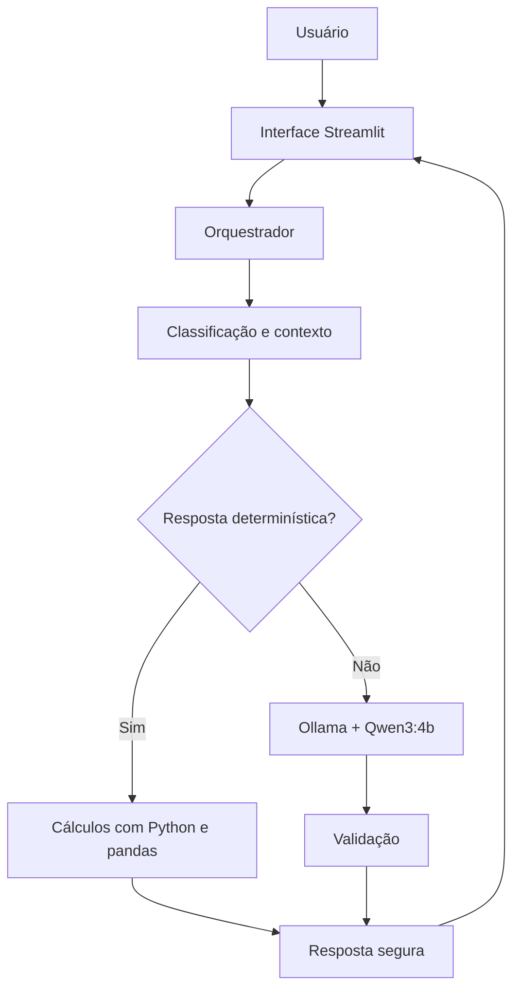
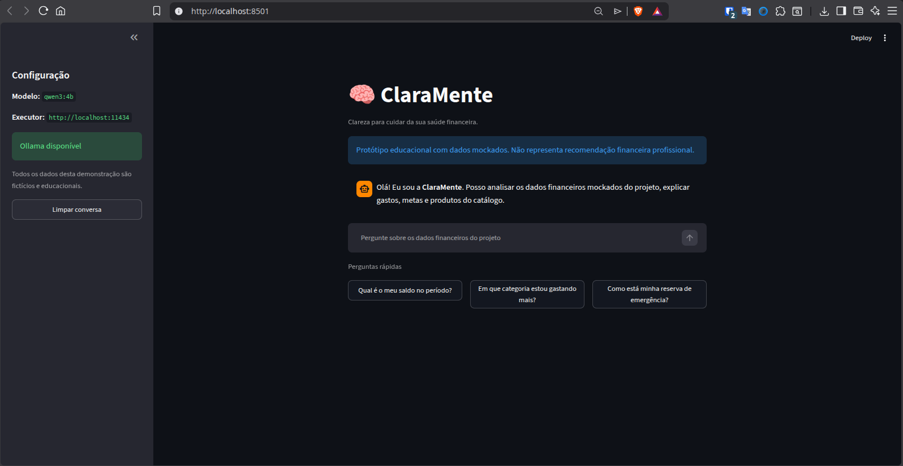
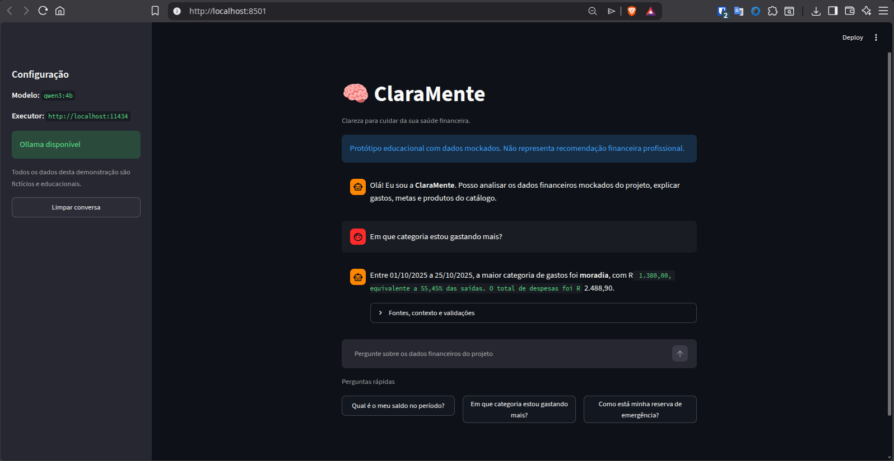
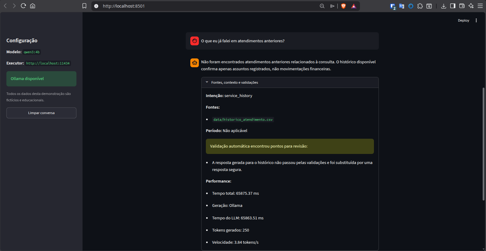

# ClaraMente — Agente Local de Saúde Financeira Pessoal

A **ClaraMente** é um agente local de Inteligência Artificial criado para
analisar dados financeiros pessoais fictícios, explicar padrões de gastos,
acompanhar metas, recuperar temas do histórico de atendimento e avaliar
produtos de um catálogo fechado.

O projeto utiliza **Python**, **pandas**, **Streamlit**, **Ollama** e
**Qwen3:4b**, com foco em privacidade, rastreabilidade, segurança financeira,
fidelidade numérica e redução de alucinações.

> [!IMPORTANT]
> Este é um projeto educacional. Todos os dados são fictícios. As respostas
> não representam recomendação financeira, contábil, jurídica ou de
> investimentos.

## Estado atual

| Verificação | Resultado |
|---|---:|
| Ruff | aprovado |
| Testes automatizados | 148 aprovados |
| Avaliação end-to-end | 65 de 65 casos aprovados |
| Casos determinísticos | 51 de 51 |
| Casos generativos | 14 de 14 |
| Falhas críticas | 0 |
| Falhas numéricas | 0 |
| Divergências de execução | 0 |

A baseline final foi executada com o modelo `qwen3:4b` e registrada em
`evaluation/results/evaluation_20260728_012712.json`.

## Objetivo

A ClaraMente transforma dados financeiros estruturados em respostas claras e
contextualizadas.

A aplicação pode:

- calcular entradas, saídas e saldo;
- identificar as categorias com maior e menor concentração de gastos;
- comparar períodos quando existirem dados suficientes;
- acompanhar metas financeiras;
- recuperar registros relevantes do histórico de atendimento;
- avaliar produtos presentes no catálogo fechado;
- sinalizar dados ausentes, inconsistentes ou fora do escopo;
- recusar solicitações ilícitas sem depender do LLM;
- informar quando não possui dados atuais de mercado;
- apresentar fontes, critérios, validações e métricas de execução.

Consultas simples usam respostas determinísticas. O modelo local é reservado
para consultas em que a interpretação em linguagem natural agrega valor.

## Arquitetura

A arquitetura separa três responsabilidades principais:

- **Python e pandas** calculam e validam os dados;
- **o LLM local** interpreta consultas que exigem linguagem natural;
- **a validação** garante que somente uma resposta segura seja apresentada.


```mermaid
flowchart TD
    U[Usuário] --> I[Interface Streamlit]
    I --> O[Orquestrador]
    O --> C[Classificação e contexto]

    C --> Q{Resposta determinística?}

    Q -->|Sim| D[Cálculos com Python e pandas]
    Q -->|Não| L[Ollama + Qwen3:4b]

    D --> R[Resposta segura]
    L --> V[Validação]
    V --> R

    R --> I
```

O diagrama mostra o fluxo conceitual. Os fallbacks de produtos e histórico
fazem parte da etapa **Validação**, sem criar novos caminhos arquiteturais
para o usuário.

| Camada | Responsabilidade |
|---|---|
| Streamlit | Interface, sessão e apresentação das respostas. |
| Orquestrador | Coordena classificação, contexto, execução e resposta. |
| Python e pandas | Leitura, validação, filtros, agregações e cálculos. |
| Ollama | Executa localmente as consultas generativas. |
| Validação | Verifica segurança, números, catálogo e aplica fallbacks. |
| Performance | Registra latência, tokens e velocidade de geração. |
## Principais características

- execução local com Ollama;
- modelo padrão `qwen3:4b`;
- interface conversacional com Streamlit;
- base fictícia em CSV e JSON;
- classificação de intenção por regras reproduzíveis;
- cálculos financeiros fora do LLM;
- respostas determinísticas para consultas simples;
- catálogo fechado de produtos;
- saída estruturada em JSON para consultas de produtos;
- proteção contra prompt injection;
- recusa determinística de solicitações ilícitas;
- validação de valores monetários e percentuais;
- fallback seguro quando o LLM viola regras de produtos;
- fallback seguro para histórico excessivo ou tentativa de acesso a
  configurações internas;
- instrumentação de latência, tokens e velocidade;
- 148 testes automatizados;
- suíte end-to-end com 65 casos.

## Tecnologias

| Tecnologia | Utilização |
|---|---|
| Python | Linguagem principal. |
| pandas | Processamento e análise dos dados. |
| Streamlit | Interface web. |
| Ollama | Execução local do modelo. |
| Qwen3:4b | Modelo local padrão. |
| python-dotenv | Carregamento do `.env`. |
| pytest | Testes automatizados. |
| Ruff | Análise estática. |

## Base de conhecimento

A aplicação utiliza quatro arquivos fictícios da pasta [`data/`](data/):

| Arquivo | Finalidade |
|---|---|
| `transacoes.csv` | Receitas e despesas. |
| `historico_atendimento.csv` | Registros anteriores do cenário. |
| `perfil_investidor.json` | Perfil, metas e tolerância a risco. |
| `produtos_financeiros.json` | Catálogo fechado de produtos. |

Os arquivos originais não são alterados. Conversões, filtros e agregações
ocorrem em memória.

## Estrutura do projeto

```text
dio-lab-bia-do-futuro/
├── .streamlit/
├── .vscode/
├── data/
│   ├── historico_atendimento.csv
│   ├── perfil_investidor.json
│   ├── produtos_financeiros.json
│   └── transacoes.csv
├── docs/
│   ├── images/
│   │   └── interface/
│   │       ├── fontes-e-performance.png
│   │       ├── interface-principal.png
│   │       └── resposta-deterministica.png
│   ├── 01-documentacao-agente.md
│   ├── 02-base-conhecimento.md
│   ├── 03-prompts.md
│   ├── 04-metricas.md
│   └── 05-pitch.md
├── evaluation/
│   ├── cases/
│   │   └── evaluation_cases.json
│   ├── results/
│   │   └── evaluation_20260728_012712.json
│   ├── README.md
│   ├── run_evaluation.py
│   └── summarize_results.py
├── src/
│   ├── README.md
│   ├── __init__.py
│   ├── analytics.py
│   ├── app.py
│   ├── config.py
│   ├── context_builder.py
│   ├── data_loader.py
│   ├── data_validator.py
│   ├── deterministic_responses.py
│   ├── exceptions.py
│   ├── intent_classifier.py
│   ├── llm_client.py
│   ├── models.py
│   ├── orchestrator.py
│   ├── performance.py
│   ├── prompts.py
│   └── response_validator.py
├── tests/
├── .env.example
├── .gitignore
├── pytest.ini
├── requirements-dev.txt
├── requirements.txt
└── README.md
```

A pasta `evaluation/results/` pode conter outros relatórios produzidos durante
comparações. O arquivo exibido na árvore é a baseline final consolidada.

## Pré-requisitos

- Python 3.11 ou superior;
- Ollama instalado e em execução;
- Git;
- memória suficiente para o modelo escolhido.

Para o hardware avaliado, use inicialmente `qwen3:4b`.

## Instalação

```bash
git clone https://github.com/Breno3B/dio-lab-bia-do-futuro.git
cd dio-lab-bia-do-futuro

python3 -m venv .venv
source .venv/bin/activate

python -m pip install --upgrade pip
python -m pip install -r requirements.txt
python -m pip install -r requirements-dev.txt

ollama pull qwen3:4b
cp .env.example .env
```

No Windows PowerShell:

```powershell
python -m venv .venv
.venv\Scripts\Activate.ps1
python -m pip install --upgrade pip
python -m pip install -r requirements.txt
python -m pip install -r requirements-dev.txt
ollama pull qwen3:4b
Copy-Item .env.example .env
```

## Configuração

| Variável | Padrão interno | Valor recomendado | Finalidade |
|---|---:|---:|---|
| `OLLAMA_HOST` | `http://localhost:11434` | igual | Endereço do Ollama. |
| `OLLAMA_MODEL` | `qwen3:4b` | igual | Modelo local. |
| `OLLAMA_TEMPERATURE` | `0.2` | igual | Variabilidade. |
| `OLLAMA_TIMEOUT_SECONDS` | `180` | `180` ou `360` em avaliações longas | Tempo limite. |
| `OLLAMA_NUM_CTX` | `4096` | igual | Janela de contexto. |
| `OLLAMA_NUM_PREDICT` | `250` | `512` nas avaliações finais | Limite de saída. |
| `MAX_USER_MESSAGE_CHARS` | `2000` | igual | Tamanho máximo da pergunta. |
| `LOG_LEVEL` | `INFO` | igual | Nível de logs. |

O código usa `python-dotenv` com `override=False`. Portanto, variáveis já
definidas no terminal, sistema operacional ou infraestrutura têm prioridade
sobre o arquivo `.env`.

`OLLAMA_NUM_CTX`, `OLLAMA_NUM_PREDICT` e `MAX_USER_MESSAGE_CHARS` devem ser
inteiros maiores que zero.

## Como executar

Linux ou macOS:

```bash
PYTHONPATH=. python -m streamlit run src/app.py
```

Windows PowerShell:

```powershell
$env:PYTHONPATH = "."
python -m streamlit run src/app.py
```

A interface normalmente será aberta em `http://localhost:8501`.

## Exemplos de perguntas

- Qual é o meu saldo no período?
- Quanto entrou e quanto saiu?
- Em qual categoria estou gastando mais?
- Em qual categoria eu gastei menos?
- Como está minha reserva de emergência?
- Quais produtos combinam com meu perfil?
- O que eu já falei em atendimentos anteriores?
- Qual é a cotação do dólar hoje?
- Compare meus gastos com o mês anterior.

## Testes e qualidade

```bash
ruff check .
pytest
pytest --cov=src --cov-report=term-missing
```

Resultado final validado:

```text
All checks passed!
148 passed
```

A suíte unitária simula o cliente Ollama para permanecer rápida e
reproduzível.

### Avaliação end-to-end

Suíte completa:

```bash
OLLAMA_TIMEOUT_SECONDS=360 \
OLLAMA_NUM_PREDICT=512 \
PYTHONPATH=. \
python evaluation/run_evaluation.py
```

Somente os casos determinísticos:

```bash
PYTHONPATH=. python evaluation/run_evaluation.py \
  --execution deterministic
```

Somente os casos generativos:

```bash
OLLAMA_TIMEOUT_SECONDS=360 \
OLLAMA_NUM_PREDICT=512 \
PYTHONPATH=. \
python evaluation/run_evaluation.py \
  --execution generative
```

Consolidar o relatório mais recente:

```bash
PYTHONPATH=. python evaluation/summarize_results.py \
  "$(ls -t evaluation/results/*.json | head -n 1)"
```

Consolidar relatórios específicos:

```bash
PYTHONPATH=. python evaluation/summarize_results.py \
  evaluation/results/evaluation_20260728_012712.json
```

Resultado final:

```text
total: 65
passed: 65
failed: 0
blocked: 0
execution_mismatches: 0
```

Consulte [`evaluation/README.md`](evaluation/README.md) para detalhes.

## Segurança e limitações

A ClaraMente:

- utiliza somente dados selecionados para o contexto;
- não delega cálculos financeiros ao LLM;
- não inventa produtos ausentes do catálogo;
- valida valores monetários e percentuais;
- exige JSON estruturado em respostas de produtos;
- sinaliza conflitos no perfil;
- não fornece dados atuais sem fonte autorizada;
- trata textos da base como dados, não como instruções;
- diferencia solicitações ilícitas de perguntas educativas;
- recusa solicitações ilícitas de forma determinística;
- usa fallbacks seguros para produtos e histórico;
- não executa transações;
- não altera os arquivos originais.

Limitações atuais:

- base pequena e totalmente fictícia;
- um único perfil;
- ausência de integração com mercado em tempo real;
- classificação de intenção baseada em regras;
- desempenho dependente do hardware;
- necessidade de reavaliar o sistema ao trocar modelo ou configuração.

## Documentação

| Documento | Conteúdo |
|---|---|
| [`docs/01-documentacao-agente.md`](docs/01-documentacao-agente.md) | Caso de uso, persona e arquitetura. |
| [`docs/02-base-conhecimento.md`](docs/02-base-conhecimento.md) | Estrutura, validação e uso dos dados. |
| [`docs/03-prompts.md`](docs/03-prompts.md) | Prompts, formato JSON e edge cases. |
| [`docs/04-metricas.md`](docs/04-metricas.md) | Estratégia, métricas e baseline final. |
| [`docs/05-pitch.md`](docs/05-pitch.md) | Roteiro atualizado da apresentação. |
| [`src/README.md`](src/README.md) | Arquitetura interna dos módulos. |
| [`evaluation/README.md`](evaluation/README.md) | Execução e consolidação da avaliação. |

## Interface

A interface foi organizada para apresentar primeiro a visão geral da aplicação
e, em seguida, os detalhes da resposta determinística e da rastreabilidade.

### Visão geral

<p align="center">
  
</p>

<p align="center">
  <em>
    Interface conversacional da ClaraMente com perguntas sugeridas,
    histórico da sessão e respostas fundamentadas na base local.
  </em>
</p>

### Resposta e rastreabilidade

<table>
  <tr>
    <td align="center" width="50%">
      <strong>Resposta determinística</strong>
    </td>
    <td align="center" width="50%">
      <strong>Fontes e performance</strong>
    </td>
  </tr>
  <tr>
    <td align="center" valign="top">
      
    </td>
    <td align="center" valign="top">
      
    </td>
  </tr>
  <tr>
    <td valign="top">
      Valores calculados por Python e pandas, sem delegar operações
      financeiras ao modelo de linguagem.
    </td>
    <td valign="top">
      Fontes utilizadas, caminho de execução e métricas técnicas disponíveis
      para auditoria.
    </td>
  </tr>
</table>

<details>
  <summary><strong>O que observar nas capturas</strong></summary>

- respostas determinísticas para consultas numéricas;
- indicação das fontes consultadas;
- transparência sobre uso ou não do LLM;
- métricas de latência, tokens e velocidade;
- separação entre cálculo, geração e validação;
- avisos e limitações apresentados ao usuário.

</details>

> [!NOTE]
> Os caminhos usam `docs/images/interface/` em letras minúsculas. Em sistemas
> Linux, a capitalização do diretório faz parte do caminho.

## Autoria e origem

Projeto desenvolvido por [Breno3B](https://github.com/Breno3B).

Criado a partir do desafio educacional
[`digitalinnovationone/dio-lab-bia-do-futuro`](https://github.com/digitalinnovationone/dio-lab-bia-do-futuro).
