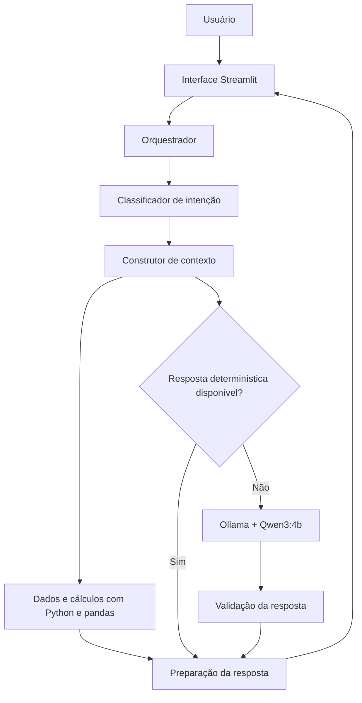

# Documentação do Agente

## Caso de uso

### Problema

Informações sobre receitas, despesas, metas, perfil de investidor e produtos
financeiros costumam ficar dispersas. Isso dificulta uma leitura integrada da
situação financeira e aumenta o risco de decisões tomadas sem contexto.

Um chatbot puramente generativo também pode inventar números, produtos,
características ou informações atuais. Em finanças, essa variabilidade precisa
ser limitada por regras, cálculos determinísticos e validação posterior.

### Solução

A **ClaraMente** reúne uma base fictícia de transações, histórico de
atendimento, perfil e produtos para produzir análises educacionais.

O agente pode:

- calcular entradas, saídas e saldo;
- identificar maior e menor categoria de gastos;
- comparar períodos quando houver dados suficientes;
- acompanhar metas;
- recuperar assuntos do histórico;
- avaliar produtos existentes no catálogo;
- sinalizar inconsistências do perfil;
- recusar dados atuais sem fonte;
- recusar solicitações ilícitas;
- aplicar respostas seguras quando a geração não atende às regras.

A ClaraMente não executa transações, não garante rentabilidade e não substitui
profissionais habilitados.

### Público-alvo

Pessoas interessadas em:

- compreender hábitos financeiros;
- organizar receitas e despesas;
- acompanhar metas;
- estudar agentes locais e responsáveis;
- entender como cálculos determinísticos e LLMs podem trabalhar em conjunto.

## Persona e tom de voz

### Nome

**ClaraMente — Agente de Saúde Financeira Pessoal**

> **ClaraMente — clareza para cuidar da sua saúde financeira.**

### Posicionamento

A ClaraMente é educacional, consultiva e transparente. Ela explica os dados e
os limites da análise, mas não toma decisões em nome do usuário.

### Personalidade

- **consultiva:** considera o contexto antes de responder;
- **educativa:** explica conceitos em linguagem simples;
- **responsável:** não afirma o que não pode fundamentar;
- **empática:** não julga hábitos financeiros;
- **transparente:** diferencia dados, cálculos e interpretações;
- **objetiva:** prioriza informações relevantes.

### Comunicação

A comunicação deve ser:

- clara e acessível;
- cordial e profissional;
- direta, sem urgência artificial;
- cuidadosa com riscos, dívidas e investimentos;
- explícita sobre dados fictícios e limitações.

O agente não deve usar linguagem alarmista, prometer resultados ou pressionar
o usuário.

## Arquitetura

A arquitetura interna é modular, mas segue um fluxo único:

```mermaid
flowchart TD
    U[Usuário] --> I[Interface Streamlit]
    I --> O[Orquestrador]

    O --> C[Classificador de intenção]
    C --> X[Construtor de contexto]

    X --> D[Dados e cálculos com Python e pandas]
    X --> Q{Resposta determinística disponível?}

    Q -->|Sim| R[Preparação da resposta]
    Q -->|Não| L[Ollama + Qwen3:4b]

    L --> V[Validação da resposta]
    D --> R
    V --> R

    R --> I
```

A etapa **Validação da resposta** concentra:

- fidelidade de valores monetários e percentuais;
- conformidade com o catálogo;
- sinalização de inconsistências do perfil;
- detecção de respostas excessivas de histórico;
- fallback seguro de produtos;
- fallback seguro de histórico;
- bloqueio seguro para outras violações.

Esses tratamentos são detalhes internos da validação e não precisam aparecer
como vários destinos independentes no diagrama principal.

### Fluxo

1. O usuário envia uma mensagem pela interface.
2. O orquestrador classifica a intenção.
3. O construtor seleciona os dados necessários.
4. Python e pandas executam cálculos e validações.
5. Consultas simples seguem para resposta determinística.
6. Consultas interpretativas são enviadas ao modelo local.
7. A saída generativa passa pelo validador.
8. A aplicação apresenta uma única resposta segura na interface.

### Componentes

| Componente | Responsabilidade |
|---|---|
| `app.py` | Interface Streamlit. |
| `intent_classifier.py` | Classificação das intenções. |
| `data_loader.py` | Leitura de CSV e JSON. |
| `data_validator.py` | Validação da base. |
| `analytics.py` | Cálculos e filtros. |
| `context_builder.py` | Seleção de fontes e montagem do contexto. |
| `deterministic_responses.py` | Respostas sem LLM. |
| `prompts.py` | System prompt e contexto dinâmico. |
| `llm_client.py` | Integração com Ollama. |
| `response_validator.py` | Segurança, fidelidade e decisão de validação. |
| `orchestrator.py` | Coordenação e aplicação dos fallbacks. |
| `performance.py` | Métricas técnicas. |
## Separação de responsabilidades

- Python e pandas são a fonte de verdade para cálculos;
- o LLM transforma contexto estruturado em linguagem natural;
- o classificador não depende do LLM;
- o catálogo é carregado e filtrado antes da geração;
- o validador verifica a saída;
- o orquestrador decide entre resposta normal, fallback e bloqueio.

Essa divisão reduz a superfície de alucinação e torna as decisões observáveis.

## Intenções

| Intenção | Execução principal |
|---|---|
| `financial_summary` | determinística |
| `expense_analysis` | determinística |
| `lowest_expense_category` | determinística |
| `period_comparison` | determinística |
| `goal_progress` | determinística |
| `current_market_data` | determinística |
| `illegal_activity` | determinística |
| `out_of_scope` | determinística |
| `unknown` | determinística |
| `product_compatibility` | generativa com JSON e fallback |
| `service_history` | generativa com limite e fallback |

## Segurança e anti-alucinação

### Estratégias implementadas

- dados validados antes do uso;
- cálculos financeiros determinísticos;
- contexto mínimo por intenção;
- catálogo fechado;
- resposta JSON para produtos;
- verificação dos produtos declarados;
- verificação de valores monetários e percentuais;
- detecção de expressões de risco;
- sinalização de inconsistência do perfil;
- recusa de informações atuais sem fonte;
- recusa determinística de solicitações ilícitas;
- fallback para pedidos adversariais de produtos;
- limite de tamanho e fallback para histórico;
- proteção contra tentativas de acesso a prompt ou regras internas.

### Fallback de produtos

O LLM continua sendo executado nos casos generativos. A saída é substituída por
uma resposta segura quando:

- o validador reprova o conteúdo;
- a própria solicitação tenta ignorar o catálogo;
- pede produto inexistente;
- pede invenção de produto;
- exige garantia de retorno ou ausência de risco.

### Fallback de histórico

A resposta de histórico é substituída quando:

- excede o limite definido pelo validador;
- contém valores não fundamentados;
- a solicitação tenta acessar prompt, regras ou configurações internas.

O fallback usa os registros relevantes presentes no contexto e não expõe a
saída inválida do modelo.

## Rastreabilidade

A resposta pode informar:

- intenção detectada;
- fontes consultadas;
- período analisado;
- cálculos utilizados;
- inconsistências e dados ausentes;
- uso ou não do LLM;
- avisos de validação;
- latência e métricas do Ollama.

## Limitações

- dados totalmente fictícios;
- base pequena;
- um único perfil;
- ausência de dados de mercado em tempo real;
- classificação por regras;
- dependência de hardware para geração local;
- avaliação necessária após qualquer troca de modelo, prompt ou configuração.

## Capturas da interface

### Interface principal

### Resposta determinística

### Fontes e performance

