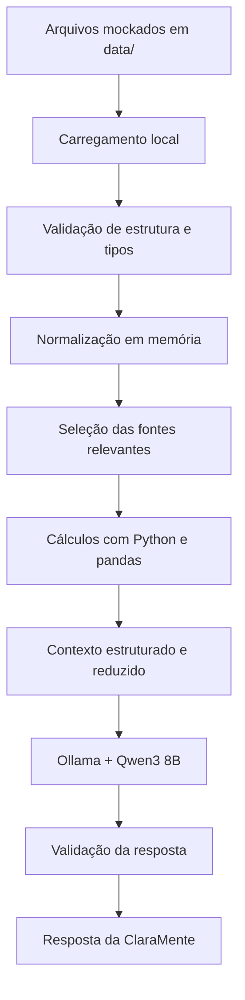

# Base de Conhecimento — ClaraMente

## Objetivo

A base de conhecimento fornece dados estruturados para que a **ClaraMente — Agente de Saúde Financeira Pessoal** possa:

- analisar receitas, despesas e padrões de consumo;
- recuperar informações relevantes de atendimentos anteriores;
- considerar objetivos, metas e tolerância a risco;
- consultar os produtos financeiros disponíveis no projeto;
- produzir explicações contextualizadas, rastreáveis e seguras.

Todos os dados presentes nesta base são **mockados**, isto é, fictícios e criados exclusivamente para fins educacionais, testes e demonstração. O repositório não deve conter dados financeiros reais, informações pessoais reais ou credenciais de usuários.

---

## Dados Utilizados

Os arquivos da base de conhecimento estão armazenados na pasta [`data/`](../data/).

| Arquivo | Formato | Papel na base | Utilização pela ClaraMente |
|---|---|---|---|
| [`transacoes.csv`](../data/transacoes.csv) | CSV | Dados transacionais mockados | Calcular receitas, despesas, saldo, participação por categoria e padrões de gastos. |
| [`historico_atendimento.csv`](../data/historico_atendimento.csv) | CSV | Histórico mockado de interações | Recuperar temas já discutidos e fornecer continuidade ao atendimento. |
| [`perfil_investidor.json`](../data/perfil_investidor.json) | JSON | Perfil financeiro mockado | Contextualizar objetivos, metas, patrimônio, reserva de emergência e tolerância a risco. |
| [`produtos_financeiros.json`](../data/produtos_financeiros.json) | JSON | Catálogo mockado de produtos | Consultar apenas os produtos disponíveis na base e avaliar sua compatibilidade com o perfil informado. |

### Classificação das fontes

Cada arquivo possui uma responsabilidade específica e não deve ser usado fora de seu contexto.

| Tipo de fonte | Arquivo | Uso permitido |
|---|---|---|
| Fonte transacional | `transacoes.csv` | Sustentar cálculos objetivos sobre entradas, saídas, saldo e categorias de gastos. |
| Contexto histórico | `historico_atendimento.csv` | Recuperar assuntos e necessidades anteriores, sem tratá-los como comprovação de movimentações financeiras. |
| Perfil do usuário | `perfil_investidor.json` | Contextualizar objetivos, metas e restrições pessoais do cenário mockado. |
| Catálogo de produtos | `produtos_financeiros.json` | Servir como única fonte autorizada para citar produtos financeiros disponíveis no projeto. |

---

## Estrutura dos Dados

### `transacoes.csv`

O arquivo contém as movimentações financeiras utilizadas nas análises de receitas e despesas.

| Campo | Tipo esperado | Obrigatório | Descrição | Regra de validação |
|---|---|---:|---|---|
| `data` | Data | Sim | Data da movimentação financeira. | Deve ser uma data válida no formato `AAAA-MM-DD`. |
| `descricao` | Texto | Sim | Identificação resumida da movimentação. | Não pode estar vazia. |
| `categoria` | Texto | Sim | Categoria associada à movimentação. | Deve ser normalizada antes das agregações. |
| `valor` | Decimal | Sim | Valor monetário da movimentação. | Deve ser numérico, não nulo e maior ou igual a zero. |
| `tipo` | Texto | Sim | Indica se a movimentação é uma entrada ou saída. | Deve possuir um dos valores esperados: `entrada` ou `saida`. |

Categorias presentes na versão inicial:

- `receita`;
- `moradia`;
- `alimentacao`;
- `lazer`;
- `saude`;
- `transporte`.

A categoria e o tipo representam conceitos diferentes:

- **categoria** descreve a finalidade da movimentação;
- **tipo** determina se o valor aumenta ou reduz o saldo.

Por exemplo, uma transação pode possuir categoria `moradia` e tipo `saida`.

---

### `historico_atendimento.csv`

O arquivo registra interações anteriores do cenário mockado.

| Campo | Tipo esperado | Obrigatório | Descrição | Regra de validação |
|---|---|---:|---|---|
| `data` | Data | Sim | Data do atendimento. | Deve ser válida e seguir o formato `AAAA-MM-DD`. |
| `canal` | Texto | Sim | Canal pelo qual ocorreu a interação. | Deve ser normalizado para comparação e filtros. |
| `tema` | Texto | Sim | Assunto principal do atendimento. | Não pode estar vazio. |
| `resumo` | Texto | Sim | Síntese da solicitação ou solução. | Não pode estar vazio. |
| `resolvido` | Texto ou booleano normalizado | Sim | Indica se o atendimento foi concluído. | Valores textuais devem ser convertidos para uma representação booleana consistente. |

O histórico serve para contextualizar a conversa, mas não substitui os dados transacionais nem comprova saldos, aplicações ou movimentações.

---

### `perfil_investidor.json`

O arquivo representa o perfil financeiro do usuário fictício.

| Campo | Tipo esperado | Obrigatório | Descrição |
|---|---|---:|---|
| `nome` | Texto | Sim | Nome fictício utilizado no cenário. |
| `idade` | Inteiro | Sim | Idade do perfil mockado. |
| `profissao` | Texto | Sim | Ocupação profissional fictícia. |
| `renda_mensal` | Decimal | Sim | Renda mensal informada no cenário. |
| `perfil_investidor` | Texto | Sim | Classificação declarada do perfil de investimento. |
| `objetivo_principal` | Texto | Sim | Principal objetivo financeiro. |
| `patrimonio_total` | Decimal | Sim | Patrimônio total informado. |
| `reserva_emergencia_atual` | Decimal | Sim | Valor atual da reserva de emergência. |
| `aceita_risco` | Booleano | Sim | Indica se o perfil declara aceitar risco. |
| `metas` | Lista de objetos | Sim | Conjunto de metas financeiras. |

Cada item de `metas` contém:

| Campo | Tipo esperado | Obrigatório | Descrição |
|---|---|---:|---|
| `meta` | Texto | Sim | Nome ou descrição da meta. |
| `valor_necessario` | Decimal | Sim | Valor necessário para alcançar a meta. |
| `prazo` | Texto no formato de data parcial | Sim | Prazo esperado no formato `AAAA-MM`. |

A aplicação deve validar possíveis inconsistências entre campos. Por exemplo, a classificação `moderado` não deve, isoladamente, anular a informação explícita `aceita_risco: false`. Em caso de conflito, a ClaraMente deve apresentar a divergência e evitar conclusões categóricas.

---

### `produtos_financeiros.json`

O arquivo funciona como catálogo fechado de produtos disponíveis no cenário.

| Campo | Tipo esperado | Obrigatório | Descrição |
|---|---|---:|---|
| `nome` | Texto | Sim | Nome do produto financeiro. |
| `categoria` | Texto | Sim | Categoria do produto. |
| `risco` | Texto | Sim | Nível de risco informado na base. |
| `rentabilidade` | Texto | Sim | Referência de rentabilidade fornecida no cenário. |
| `aporte_minimo` | Decimal | Sim | Valor mínimo de aplicação. |
| `indicado_para` | Texto | Sim | Descrição do público ou objetivo compatível. |

A ClaraMente não deve:

- inventar produtos ausentes no arquivo;
- assumir taxas, liquidez, tributação ou garantias que não estejam registradas;
- tratar a rentabilidade textual como promessa de retorno;
- apresentar a compatibilidade encontrada como recomendação profissional definitiva.

---

## Adaptações nos Dados

Nesta etapa, os arquivos mockados fornecidos pelo desafio serão preservados em sua estrutura original.

A aplicação poderá realizar transformações apenas em memória, sem modificar os arquivos-fonte:

- conversão das datas para tipos apropriados;
- conversão dos valores monetários para tipos numéricos;
- normalização de categorias e textos;
- conversão de indicadores textuais para booleanos;
- ordenação cronológica;
- tratamento de campos ausentes;
- identificação de registros duplicados;
- geração de indicadores agregados;
- montagem de resumos estruturados para o modelo de linguagem.

Manter os arquivos originais permite:

- preservar a rastreabilidade dos dados de entrada;
- reproduzir os resultados;
- comparar o dado bruto com o dado processado;
- evitar alterações silenciosas na fonte.

Caso os arquivos sejam expandidos futuramente, as mudanças deverão ser documentadas nesta seção, incluindo campos adicionados, regras de preenchimento e impacto nas análises.

---

## Estratégia de Integração

### Como os dados são carregados?

A aplicação Python carrega os arquivos localmente no início da sessão ou sob demanda, conforme a análise solicitada.

O fluxo previsto é:

1. localizar os arquivos na pasta `data/`;
2. verificar se todos os arquivos obrigatórios existem;
3. carregar os arquivos CSV com [pandas](https://pandas.pydata.org/);
4. carregar os arquivos JSON com os recursos nativos do [Python](https://www.python.org/);
5. validar estrutura, tipos e campos obrigatórios;
6. normalizar os dados em memória;
7. disponibilizar estruturas confiáveis para a camada de análise.

Erros de leitura ou validação devem ser tratados antes da montagem do contexto. A aplicação não deve enviar ao modelo dados incompletos como se fossem válidos.

### Validações mínimas

Antes do uso, a aplicação deve verificar:

- existência e legibilidade dos arquivos;
- presença das colunas e chaves obrigatórias;
- tipos e formatos esperados;
- datas inválidas;
- valores monetários nulos ou não numéricos;
- valores negativos incompatíveis com o modelo adotado;
- registros duplicados;
- categorias ou tipos desconhecidos;
- consistência das metas financeiras;
- consistência entre perfil declarado e tolerância a risco;
- integridade dos registros do catálogo de produtos.

Quando uma validação falhar, a resposta deve indicar a limitação ou a aplicação deve interromper a análise com uma mensagem clara. Não se deve preencher automaticamente uma informação essencial ausente.

---

### Como os dados são selecionados?

A base de conhecimento não deve ser enviada integralmente ao modelo em todas as interações.

A camada de aplicação identifica a intenção da pergunta e seleciona apenas as fontes necessárias.

| Intenção da pergunta | Fontes principais |
|---|---|
| Analisar receitas, despesas ou saldo | `transacoes.csv` |
| Comparar categorias ou períodos | `transacoes.csv` |
| Identificar assuntos já discutidos | `historico_atendimento.csv` |
| Avaliar o progresso de metas | `perfil_investidor.json` e `transacoes.csv`, quando necessário |
| Consultar opções disponíveis | `perfil_investidor.json` e `produtos_financeiros.json` |
| Verificar compatibilidade com um produto | `perfil_investidor.json` e `produtos_financeiros.json` |
| Produzir uma visão financeira integrada | Todas as fontes relevantes para a solicitação |

Essa seleção reduz:

- uso desnecessário da janela de contexto;
- exposição de dados não relacionados à pergunta;
- ruído na interpretação do modelo;
- risco de respostas baseadas em informações irrelevantes.

---

## Processamento Determinístico

Os cálculos financeiros devem ser executados pela aplicação com Python e pandas, e não delegados ao modelo de linguagem.

Entre os cálculos previstos estão:

- total de entradas;
- total de saídas;
- saldo do período;
- total por categoria;
- participação percentual de cada categoria;
- comparação entre períodos;
- variação absoluta e percentual;
- identificação de possíveis despesas recorrentes;
- diferença entre o valor atual e o valor necessário para uma meta;
- percentual de progresso de uma meta;
- filtragem de produtos por risco, aporte mínimo e finalidade declarada.

O **Qwen3 8B**, executado localmente pelo **Ollama**, recebe os resultados já calculados e os transforma em uma explicação acessível.

Essa separação de responsabilidades reduz erros porque:

- Python executa operações numéricas reproduzíveis;
- pandas realiza filtros e agregações estruturadas;
- o LLM interpreta a pergunta e redige a resposta;
- as regras de negócio limitam conclusões não sustentadas pelos dados.

---

### Como os dados são usados no prompt?

Os arquivos brutos não são inseridos diretamente no `system prompt`.

O `system prompt` contém instruções permanentes sobre:

- identidade e comportamento da ClaraMente;
- tom de voz;
- limites de atuação;
- regras de segurança;
- obrigação de declarar incertezas;
- proibição de inventar dados ou produtos.

Os dados selecionados para cada pergunta são enviados em um contexto dinâmico, separado das instruções permanentes.

Esse contexto pode conter:

1. intenção identificada;
2. período analisado;
3. fontes consultadas;
4. filtros aplicados;
5. resultados calculados;
6. informações relevantes do perfil;
7. produtos encontrados no catálogo;
8. inconsistências ou dados ausentes;
9. restrições específicas para a resposta.

Sempre que possível, os registros brutos devem ser convertidos em resumos estruturados antes de serem enviados ao modelo.

---

## Fluxo da Base de Conhecimento



---

## Exemplo de Contexto Montado

O exemplo abaixo é apenas ilustrativo. Seus valores não devem ser interpretados como o resultado real da base sem que a aplicação execute os cálculos correspondentes.

```text
IDENTIDADE DO AGENTE:
ClaraMente — Agente de Saúde Financeira Pessoal

INTENÇÃO:
Analisar a distribuição das despesas no período informado.

FONTES CONSULTADAS:
- data/transacoes.csv

PERÍODO:
2025-10-01 a 2025-10-31

FILTROS:
- tipo = saida

RESULTADOS CALCULADOS PELA APLICAÇÃO:
- Total de entradas: [valor calculado]
- Total de saídas: [valor calculado]
- Saldo do período: [valor calculado]
- Categoria com maior gasto: [categoria calculada]
- Participação da categoria: [percentual calculado]

DADOS AUSENTES OU LIMITAÇÕES:
- Não há orçamento mensal definido por categoria.
- A base contém somente um período curto de transações mockadas.

RESTRIÇÕES PARA A RESPOSTA:
- Não classificar um gasto como excessivo sem uma meta ou referência.
- Diferenciar fatos calculados de sugestões educacionais.
- Não inventar transações, categorias ou períodos.
- Informar que a análise utiliza dados mockados.
```

### Exemplo de contexto para consulta de produtos

```text
INTENÇÃO:
Apresentar produtos do catálogo compatíveis com o objetivo de reserva de emergência.

FONTES CONSULTADAS:
- data/perfil_investidor.json
- data/produtos_financeiros.json

DADOS RELEVANTES DO PERFIL:
- Objetivo principal: Construir reserva de emergência
- Aceita risco: false
- Perfil declarado: moderado

PRODUTOS ENCONTRADOS NO CATÁLOGO:
- [produtos filtrados pela aplicação]

PONTOS DE ATENÇÃO:
- Existe possível divergência entre o perfil declarado como moderado e a
  informação explícita de que o usuário não aceita risco.
- Rentabilidades registradas são dados mockados e não representam condições
  atuais de mercado.

RESTRIÇÕES PARA A RESPOSTA:
- Não apresentar promessa de rentabilidade.
- Não inventar produtos ou características.
- Explicar os critérios utilizados no filtro.
- Apresentar as opções como conteúdo educacional, não como recomendação
  profissional individualizada.
```

---

## Rastreabilidade

Sempre que aplicável, a ClaraMente deve informar:

- quais arquivos foram consultados;
- qual período foi analisado;
- quais filtros foram aplicados;
- quais indicadores foram calculados;
- quais produtos foram considerados;
- quais dados estavam ausentes ou inconsistentes;
- quais limitações afetaram a resposta.

A resposta deve diferenciar claramente:

- **fatos da base:** informações presentes nos arquivos;
- **resultados calculados:** indicadores produzidos pela aplicação;
- **inferências:** interpretações fundamentadas nos resultados;
- **sugestões educacionais:** possibilidades apresentadas sem caráter de recomendação profissional.

---

## Privacidade e Segurança

- A base contém apenas dados mockados.
- Dados pessoais ou financeiros reais não devem ser adicionados ao repositório público.
- O processamento dos arquivos e a execução do LLM ocorrem localmente.
- Os dados não devem ser enviados a APIs externas.
- Informações sensíveis não devem ser registradas integralmente nos logs.
- O modelo deve receber somente os dados necessários para responder à pergunta.
- Produtos ausentes no catálogo não podem ser inventados.
- Informações de rentabilidade não devem ser tratadas como garantia de retorno.
- Respostas sobre investimentos devem manter caráter educacional e consultivo.
- Dados insuficientes devem resultar em ressalva ou solicitação de informação adicional.

---

## Limitações da Base

A base de conhecimento possui limitações próprias de um projeto educacional:

- contém poucos registros;
- cobre um período transacional curto;
- representa apenas um perfil fictício;
- não contém cotações ou indicadores de mercado em tempo real;
- não registra orçamento mensal por categoria;
- não contém todas as informações necessárias para uma análise financeira completa;
- apresenta um catálogo limitado e mockado de produtos;
- não substitui dados oficiais de instituições financeiras;
- não representa condições atuais de rentabilidade, tributação ou liquidez.

Essas limitações devem ser consideradas na interpretação dos resultados e declaradas quando forem relevantes para a pergunta do usuário.
